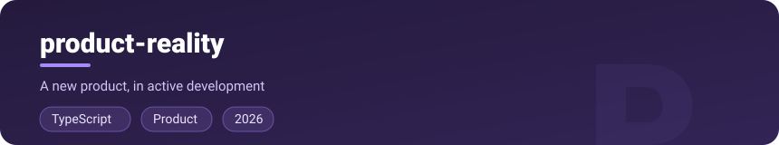
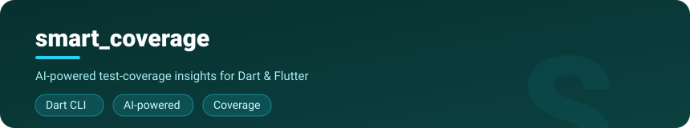

<h1 align="center">Hi, I'm Adeyemo Adedamola 👋</h1>

  <b>Lead Software Engineer</b> · Mobile · Backend · AI Tooling · Platform & Infra

  
  
  
  

---

### 👨‍💻 About me

I'm a **Lead Software Engineer** with **10+ years** of industry experience, originally rooted in mobile (Java, Kotlin, Swift, Flutter) and now leading and building across the full stack — backend services, AI-powered developer tooling, and the platform/infrastructure that runs them.

I care deeply about well-architected, scalable systems: clean architecture, structured design patterns, and coding standards that hold up as products grow. Over the years I've shipped production software across **E-commerce, E-logistics, Tele-medicine, FinTech and business automation**, led mobile teams, and maintained open-source libraries used by thousands of developers.

These days my focus has broadened beyond apps — I run my own Kubernetes cluster, automate workflows with n8n, build AI/LLM-assisted tooling around code review and quality, and work with vector databases and modern TypeScript/NestJS backends.

- 🔭 Building **[SendOS](https://sendos.app)**, **[TafiCloud](https://taficloud.com)**, and **product-reality**
- 🌱 Deep in **AI/LLM tooling**, **vector databases (Weaviate)**, and **platform engineering**
- 🛠️ Maintaining open-source Flutter & developer-tooling projects
- 💬 Ask me about **Flutter architecture**, **mobile at scale**, **CI/CD**, or **self-hosted infra**

---

### 🧰 Tech Stack

---

### 🏗️ Currently Building — 2026 Focus

**[SendOS](https://sendos.app)** is a complete, deploy-ready logistics stack — a branded **customer app**, **rider app**, and **operations dashboard** that work as one. Built from the ground up for African realities: **landmark-based addressing** (no postal codes needed), resilient on **3G with aggressive offline caching and auto-retries**, native **bank transfer, USSD & mobile-money** payments, and tuned for **mid-range Android** devices. Operators configure their brand and go live in **48–72 hours**.

**[TafiCloud](https://taficloud.com)** is a smart cloud file & media platform that makes heavy file workflows effortless: **upload, download, merge files, extract media metadata, and convert between formats** through a clean API — complete with a native **Swift SDK** (CocoaPods & SPM) for seamless iOS integration.

**product-reality** is a new product I'm actively building in TypeScript. *(More details coming soon.)*

> Several of these live in private repositories while in active development.

---

### 🚀 Featured Open Source

**[flutter_polyline_points](https://github.com/Dammyololade/flutter_polyline_points)** &nbsp; — decodes encoded Google polyline strings into geo-coordinates for drawing routes on maps. One of the most widely-used polyline plugins in the Flutter ecosystem.

**[smart_coverage](https://github.com/Dammyololade/smart_coverage)** &nbsp; — a modern Dart CLI for intelligent test-coverage analysis with AI-powered insights for Flutter/Dart projects.

**[ticket-pr-validation-action](https://github.com/Dammyololade/ticket-pr-validation-action)** &nbsp; — a GitHub Action that validates PRs against Linear tickets, extracts acceptance criteria, and triggers AI-assisted reviews.

**[loki_logger](https://github.com/Dammyololade/loki_logger)** &nbsp; — a Flutter plugin for shipping application logs straight to a Grafana Loki server.

**More on GitHub:** [weaviate-console](https://github.com/Dammyololade/weaviate-console) · [flutter_github_explorer](https://github.com/Dammyololade/flutter_github_explorer) · [all repositories »](https://github.com/Dammyololade?tab=repositories)

---

### 📊 GitHub Stats

  
  

  

---

### 📫 How to reach me
- **Email:** dammyololade2010@gmail.com
- **LinkedIn:** https://www.linkedin.com/in/adeyemo-adedamola/
- **Twitter:** https://twitter.com/dammyololade
- **Medium:** https://medium.com/@dammyololade2010
